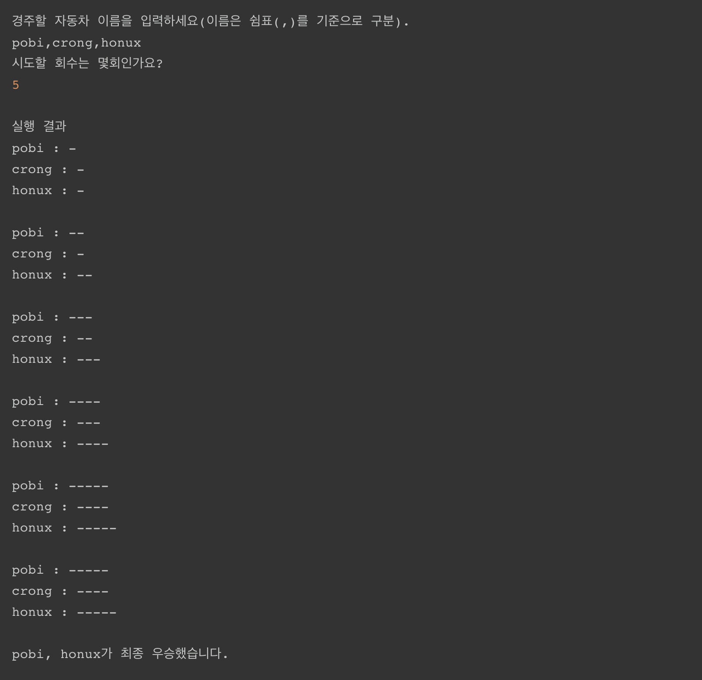

# Racing Car

### 기능 요구사항

- 주어진 횟수 동안 n대의 자동차는 전진 또는 멈출 수 있다.
- 각 자동차에 이름을 부여할 수 있다. 전진하는 자동차를 출력할 때 자동차 이름을 같이 출력한다.
- 자동차 이름은 쉼표(,)를 기준으로 구분하며 이름은 5자 이하만 가능하다.
- 사용자는 몇 번의 이동을 할 것인지를 입력할 수 있어야 한다.
- 전진하는 조건은 0에서 9 사이에서 random 값을 구한 후 random 값이 4 이상일 경우 전진하고, 3 이하의 값이면 멈춘다.
- 자동차 경주 게임을 완료한 후 누가 우승했는지를 알려준다. 우승자는 한 명 이상일 수 있다.

### 실행 결과

- 위 요구사항에 따라 3대의 자동차가 5번 움직였을 경우 프로그램을 실행한 결과는 다음과 같다.

### 기능 구현

##### Car
- 이름, 현재 위치 저장
- 이동

##### Cars
- 전체 자동차의 상태 관리
- 1등 구하

##### Race
- 입력한 라운드만큼 레이스 진행
- 레이스 종료 후 우승자 구하기